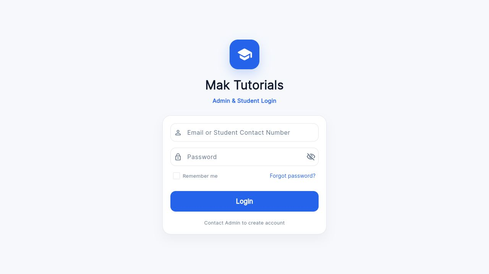
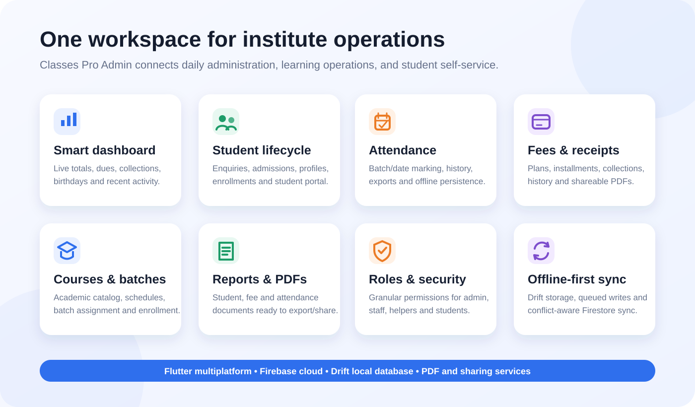
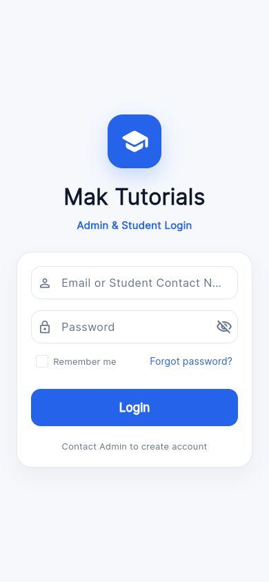
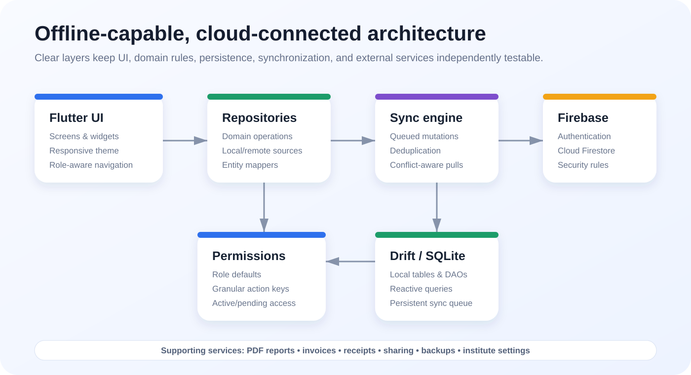

# Classes Pro Admin

<p align="center">
  
</p>

<p align="center">
  A responsive, offline-capable institute management application built with Flutter, Firebase, and Drift.
</p>

<p align="center">
  
  
  
  
</p>

Classes Pro Admin is designed for coaching institutes and tutorial centres that need one place to manage students, admissions, batches, attendance, fees, reports, reminders, staff access, and student self-service. The app combines Firebase-backed collaboration with a local Drift database and a queued sync engine for resilient day-to-day operations.



## Product overview



### Core capabilities

- **Student lifecycle:** enquiries, admissions, enrollments, student profiles, courses, and batches.
- **Attendance:** date- and batch-based marking with offline persistence and conflict-aware synchronization.
- **Fees:** installment tracking, collections, outstanding balances, payment history, receipts, and PDF statements.
- **Operations dashboard:** student totals, today's attendance, upcoming dues, collections, birthdays, schedules, and recent activity.
- **Reports and documents:** student PDFs, attendance reports, fee statements, invoices, and shareable receipts.
- **Role-based access:** Admin, Co Admin, Receptionist, Student Helper, and Student accounts with granular permissions.
- **Student portal:** contact-number login and a dedicated student-facing experience.
- **Backup and safety:** export/restore workflows, Firestore security rules, local data persistence, and deduplicated sync queues.

## Responsive experience

<p align="center">
  
</p>

The same Flutter codebase targets Android, iOS, Web, Windows, macOS, and Linux. The interface uses responsive constraints, reusable cards, a consistent theme, and role-aware navigation.

## Architecture



The offline foundation uses Drift/SQLite as the local source for supported entities. Mutations are recorded in a deduplicated sync queue, pushed to Firestore, and followed by conflict-aware remote pulls. Pending local changes are protected from being overwritten by older remote data.

## Technology stack

| Layer | Technology |
| --- | --- |
| UI | Flutter, Material, Google Fonts, glassmorphism, staggered animations |
| Authentication | Firebase Authentication |
| Cloud data | Cloud Firestore |
| Local data | Drift, SQLite |
| Sync | Queued offline-first sync engine with entity mappers |
| Documents | `pdf`, invoice/receipt/report services, `share_plus` |
| Utilities | `intl`, `http`, `url_launcher`, `image_picker`, `table_calendar` |
| Quality | Flutter lints and focused unit/widget tests |

## Project structure

```text
lib/
|- core/                 # Authentication, fee rules, Drift database and DAOs
|- data/
|  |- local/             # Local data sources
|  |- remote/            # Firebase data sources
|  |- mappers/           # Firestore <-> local model conversion
|  |- repositories/      # Offline-first repository contracts/implementations
|  `- sync/              # Bootstrap, startup coordination and sync engine
|- models/               # Domain models and permission definitions
|- screens/              # Admin, staff and student application screens
|- services/             # Auth, reports, PDF, backup and settings services
|- theme/                # Shared visual system
`- widgets/              # Reusable application components
```

## Getting started

### Prerequisites

- Flutter SDK compatible with Dart `^3.11.4`
- A Firebase project with Authentication and Cloud Firestore enabled
- FlutterFire CLI if you need to connect a different Firebase project

### Run locally

```bash
flutter pub get
flutter run
```

To use your own Firebase project, regenerate the platform configuration:

```bash
dart pub global activate flutterfire_cli
flutterfire configure
```

Then review and deploy the included Firestore rules:

```bash
firebase deploy --only firestore:rules
```

> Do not use production student data while developing. Create dedicated test users and test collections in your Firebase environment.

## Validation

```bash
flutter analyze
flutter test
```

The test suite covers student login normalization, fee calculations, local repositories, reactive queries, queue deduplication, persistence, mapper compatibility, idempotent remote application, and sync conflict handling.

## Security model

- Firebase Authentication gates application access.
- User profiles can be active, pending, or denied.
- Fine-grained permission keys control view, create, edit, delete, export, collection, staff, settings, and backup actions.
- Firestore rules are versioned in [`firestore.rules`](firestore.rules).
- Temporary student credentials should be shared securely and changed after first login.

### Private branding assets

Handwritten signatures are intentionally excluded from Git. Configure a hosted signature in institute settings or add `assets/signature/signature.png` only in your trusted local/deployment environment. The PDF service safely omits the signature when neither source is available.

## Platform support

| Android | iOS | Web | Windows | macOS | Linux |
| :---: | :---: | :---: | :---: | :---: | :---: |
| Yes | Yes | Yes | Yes | Yes | Yes |

## Roadmap

- Expand offline-first coverage across the remaining fee and reporting workflows.
- Add integration tests for authenticated end-to-end journeys.
- Add configurable notifications for reminders and fee due dates.
- Add deployment profiles for staging and production Firebase environments.

## Author

Built by **Mohsin Khan** as a practical institute-management solution for Mak Tutorials.
